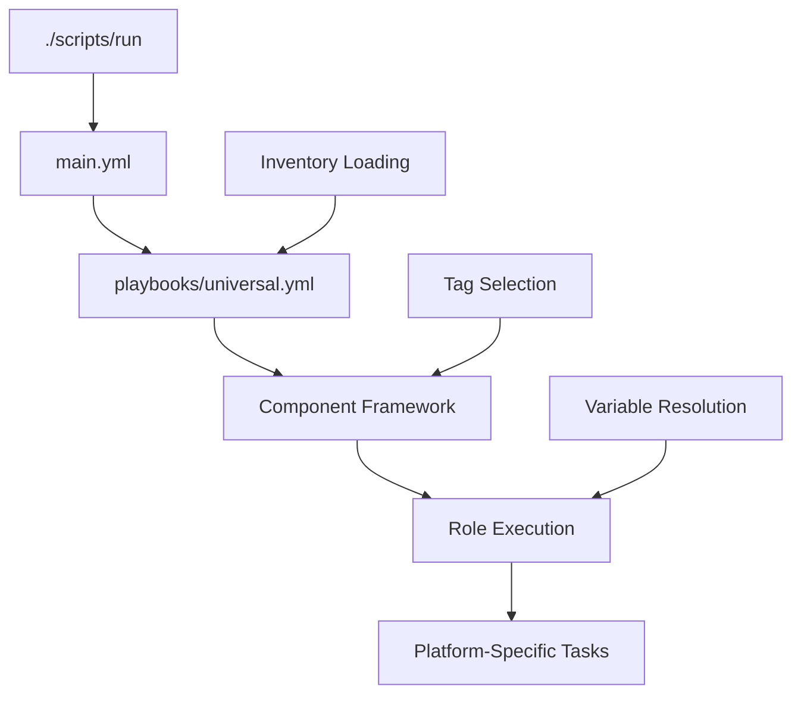
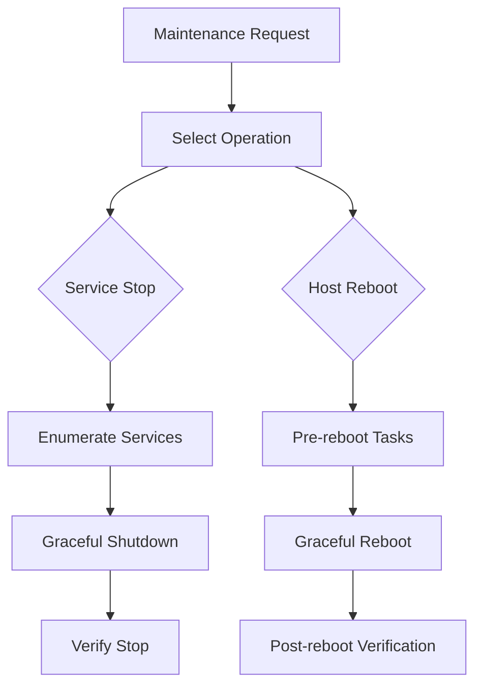

# oaAnsible Architecture Guide

Comprehensive guide to the modern oaAnsible architecture, component relationships, and deployment patterns.

## 🏗️ System Design Overview

oaAnsible is built around a **component-based architecture** with centralized deployment through the universal playbook framework. The system has been
completely refactored for maintainability, performance, and operational simplicity.

### Core Principles

- **Single Entry Point**: All deployments route through `./scripts/run` → `universal.yml`
- **Component-Based**: Services deployed via tags with modular role architecture
- **Project-Centric**: Clean inventory organization by project and environment
- **Idempotent Operations**: All tasks can be run repeatedly safely
- **Platform Agnostic**: Unified deployment across macOS and Ubuntu platforms

## 📁 Inventory Architecture

### Project-Centric Structure

```bash
inventory/
├── projects/                           # Project organization
│   ├── f1/                            # F1 project
│   │   ├── prod.yml                   # Production hosts
│   │   ├── preprod.yml                # Pre-production hosts
│   │   └── staging.yml                # Staging hosts
│   ├── spectra/                       # Spectra project
│   ├── evenko/                        # Evenko project
│   └── alpr/                          # ALPR project
├── group_vars/                        # Variable hierarchy
│   ├── all/                          # Global defaults
│   │   ├── ansible_connection.yml     # Connection settings
│   │   ├── runtime_versions.yml       # Software versions
│   │   ├── common_packages.yml        # Package lists
│   │   └── vault.yml                 # Encrypted secrets
│   ├── platforms/                     # Platform-specific
│   │   ├── macos.yml                 # macOS defaults
│   │   └── ubuntu.yml                # Ubuntu defaults
│   ├── environments/                  # Environment-specific
│   │   ├── production.yml            # Production settings
│   │   ├── preprod.yml               # Pre-prod settings
│   │   └── staging.yml               # Staging settings
│   ├── f1_base.yml                   # Project base config
│   ├── spectra_base.yml              # Project base config
│   └── evenko_base.yml               # Project base config
└── components/                        # Component configurations
    ├── macos-api.yml                 # API component config
    ├── tracker.yml                   # Tracker component config
    └── alpr.yml                      # ALPR component config
```

### Variable Inheritance Flow

**Hierarchical precedence** (lowest to highest priority):

```text
1. Global defaults (group_vars/all/)
2. Platform defaults (group_vars/platforms/macos.yml)
3. Project base (group_vars/f1_base.yml)
4. Environment (group_vars/environments/production.yml)
5. Component (inventory/components/macos-api.yml)
6. Host variables (inventory/projects/f1/prod.yml)
```

**Example inheritance for `f1-ca-001` in production:**

```text
all → macos → f1_base → production → host_specific
```

## 🔄 Deployment Flow Architecture

### Universal Playbook System

**Centralized routing** through the universal framework:



### Component Framework

**Tag-based deployment** enables precise control:

```yaml
# Universal playbook structure
- name: "Universal Deployment Framework"
  hosts: all
  tasks:
    - include_role:
        name: "{{ component_role }}"
      when: component_tag in ansible_run_tags
      tags: "{{ component_tag }}"
```

**Available component tags:**

- **Infrastructure**: `base`, `network`, `security`, `python`, `node`
- **Services**: `macos-api`, `tracker`, `player`, `alpr`, `camguard`
- **Platform**: `ml`, `nvidia`, `docker`

### Script Workflow

**Modernized script architecture:**

```bash
# Primary workflow
./scripts/run projects/f1/prod -t macos-api
    ↓
1. Parse arguments (inventory, tags, options)
2. Validate inventory structure
3. Load SSH keys from vault
4. Execute: ansible-playbook universal.yml -i inventory -t tags
5. Verify deployment success
```

## 🧩 Component Architecture

### macOS Component Stack

**Layered deployment approach:**

```bash
┌─────────────────────────────────────┐
│          Application Layer          │
│  ┌─────────────┐ ┌─────────────┐   │
│  │  macos-api  │ │   tracker   │   │
│  └─────────────┘ └─────────────┘   │
├─────────────────────────────────────┤
│           Service Layer             │
│  ┌─────────────┐ ┌─────────────┐   │
│  │   player    │ │  camguard   │   │
│  └─────────────┘ └─────────────┘   │
├─────────────────────────────────────┤
│         Platform Layer              │
│  ┌─────────────┐ ┌─────────────┐   │
│  │  security   │ │  settings   │   │
│  └─────────────┘ └─────────────┘   │
├─────────────────────────────────────┤
│       Infrastructure Layer          │
│  ┌─────────────┐ ┌─────────────┐   │
│  │    base     │ │   network   │   │
│  └─────────────┘ └─────────────┘   │
└─────────────────────────────────────┘
```

### Ubuntu Component Stack

**Specialized for ML workstations:**

```bash
┌─────────────────────────────────────┐
│        ML Application Layer         │
│  ┌─────────────┐ ┌─────────────┐   │
│  │ oaSentinel  │ │  ml_tools   │   │
│  └─────────────┘ └─────────────┘   │
├─────────────────────────────────────┤
│         Hardware Layer              │
│  ┌─────────────┐ ┌─────────────┐   │
│  │   nvidia    │ │   docker    │   │
│  └─────────────┘ └─────────────┘   │
├─────────────────────────────────────┤
│       Infrastructure Layer          │
│  ┌─────────────┐ ┌─────────────┐   │
│  │    base     │ │   network   │   │
│  └─────────────┘ └─────────────┘   │
└─────────────────────────────────────┘
```

## 🔧 Role Architecture

### Modular Role Design

**Roles broken down by function** (94% complexity reduction achieved):

```bash
roles/
├── macos/
│   ├── base/                          # 594→42 lines (93% reduction)
│   │   ├── tasks/
│   │   │   ├── main.yml              # Orchestration
│   │   │   ├── audio_config.yml      # Audio setup
│   │   │   ├── desktop_config.yml    # Desktop management
│   │   │   └── enhance_zsh.yml       # Shell configuration
│   │   ├── handlers/main.yml         # Event handlers
│   │   └── defaults/main.yml         # Default variables
│   ├── api/                          # 302→43 lines (86% reduction)
│   ├── tracker/                      # 647→32 lines (95% reduction)
│   └── network/tailscale/            # 657→32 lines (95% reduction)
├── ubuntu/
│   ├── base/                         # Core system setup
│   ├── ml_workstation/               # 312→30 lines (90% reduction)
│   └── network/tailscale/            # VPN configuration
└── common/
    ├── ml_workstation/               # Shared ML components
    ├── monitoring/                   # Health monitoring
    └── service_manager/              # Service management
```

### Task Modularization Example

**Before refactoring** (monolithic task file):

```yaml
# Single 647-line main.yml with everything mixed together
- name: Install dependencies, configure system, setup services, etc.
  # 600+ lines of mixed concerns
```

**After refactoring** (modular approach):

```yaml
# main.yml (32 lines) - orchestration only
- import_tasks: system_setup.yml # System configuration
- import_tasks: python_setup.yml # Python environment
- import_tasks: service_setup.yml # Service installation
- import_tasks: verify_deployment.yml # Validation
```

## 🛠️ Service Architecture

### macOS Service Pattern

**LaunchAgent-based services:**

```text
Service Deployment Pattern:
1. Create application directory structure
2. Install dependencies (Python, packages)
3. Deploy application code and configuration
4. Generate LaunchAgent plist
5. Load and start service
6. Verify service health
```

**Service structure example (macos-api):**

```bash
~/orangead/macos-api/
├── .venv/                            # Virtual environment
├── macos_api/                        # Application code
│   ├── bin/                         # Entry scripts
│   ├── core/                        # Core modules
│   ├── models/                      # Data models
│   ├── routers/                     # API routes
│   └── services/                    # Business logic
├── logs/                            # Service logs
├── config.yml                      # Configuration
└── requirements.txt                 # Dependencies
```

**LaunchAgent integration:**

```xml
<!-- com.orangead.macosapi.plist -->
<plist>
  <dict>
    <key>Label</key>
    <string>com.orangead.macosapi</string>
    <key>ProgramArguments</key>
    <array>
      <string>{{ python_path }}</string>
      <string>{{ app_path }}/main.py</string>
    </array>
    <key>RunAtLoad</key>
    <true/>
    <key>KeepAlive</key>
    <true/>
  </dict>
</plist>
```

### Ubuntu Service Pattern

**SystemD-based services:**

```text
Service Deployment Pattern:
1. Create application directory
2. Setup Python environment
3. Install application and dependencies
4. Generate SystemD unit file
5. Enable and start service
6. Configure log management
```

## 🔒 Security Architecture

### Multi-Layer Security

**Defense in depth approach:**

```bash
┌─────────────────────────────────────┐
│         Application Security        │
│  • API authentication              │
│  • Input validation                │
│  • Secure configurations           │
├─────────────────────────────────────┤
│          System Security            │
│  • TCC permissions (macOS)         │
│  • Firewall configuration          │
│  • User privilege management       │
├─────────────────────────────────────┤
│         Network Security            │
│  • Tailscale VPN encryption        │
│  • Private network isolation       │
│  • SSH key authentication          │
├─────────────────────────────────────┤
│          Data Security              │
│  • Ansible Vault encryption        │
│  • Secure credential storage       │
│  • Certificate management          │
└─────────────────────────────────────┘
```

### Vault Architecture

**Secure secret management:**

```yaml
# Vault structure
vault_secrets:
  network:
    tailscale_auth_key: "encrypted"
    ssh_private_key: "encrypted"

  api_credentials:
    production: "encrypted"
    preprod: "encrypted"

  system:
    sudo_passwords: "encrypted"
    certificates: "encrypted"
```

## 📊 Maintenance Architecture

### Professional Maintenance Framework

**Dedicated maintenance playbooks:**

```bash
playbooks/maintenance/
├── stop_services.yml                 # Service management
│   ├── Platform detection (macOS/Ubuntu)
│   ├── Service enumeration
│   ├── Graceful shutdown
│   └── Status reporting
├── reboot_hosts.yml                  # Host management
│   ├── Pre-reboot service shutdown
│   ├── Graceful reboot with delays
│   ├── Post-reboot verification
│   └── Service auto-start
└── README.md                         # Usage documentation
```

**Maintenance workflow:**



## 🚀 Performance Architecture

### Optimization Strategies

**Achieved performance improvements:**

1. **Role Complexity Reduction**: 94% average reduction

   - `macos/alpr_service`: 777→37 lines (95% reduction)
   - `macos/base`: 594→42 lines (93% reduction)
   - `macos/tracker`: 647→32 lines (95% reduction)

2. **Playbook Consolidation**: 60% reduction

   - 13+ playbooks → 5 active playbooks
   - Eliminated redundant workflows
   - Centralized through universal.yml

3. **Script Streamlining**: 100% structure support
   - Modern inventory structure support
   - Deprecated legacy scripts with clear migration
   - Enhanced primary entry points

### Execution Patterns

**Parallel execution support:**

```bash
# Multiple host deployment
ansible-playbook -f 10 universal.yml -i projects/f1/prod.yml

# Component-specific parallel deployment
ansible-playbook universal.yml -i projects/spectra/prod.yml -t "base,network" -f 5
```

## 🔄 Integration Architecture

### CI/CD Integration

**Pipeline-friendly design:**

```yaml
# Example GitHub Actions integration
- name: Deploy Infrastructure
  run: |
    ./scripts/run projects/f1/preprod --check
    ./scripts/run projects/f1/preprod -t macos-api
    ./scripts/run projects/f1/preprod --verify
```

### Monitoring Integration

**Health check architecture:**

```bash
# Service health verification
ansible all -i projects/f1/prod.yml -m uri \
  -a "url=http://localhost:9090/health method=GET"

# System resource monitoring
ansible all -i projects/f1/prod.yml -m setup \
  -a "filter=ansible_memory_mb"
```

## 📈 Scalability Architecture

### Multi-Environment Management

**Scalable project organization:**

```bash
Projects Scale:          Environments Scale:        Hosts Scale:
f1/                      prod.yml (10+ hosts)      Parallel execution
├── prod.yml            preprod.yml (5+ hosts)     Load balancing
├── preprod.yml         staging.yml (3+ hosts)     Resource optimization
└── staging.yml
```

### Component Scalability

**Independent component deployment:**

```bash
# Scale individual services
./scripts/run projects/f1/prod -t macos-api -l "f1-ca-001,f1-ca-002"

# Scale infrastructure components
./scripts/run projects/spectra/prod -t "base,network" -f 10
```

This architecture provides a solid foundation for scalable, maintainable infrastructure automation that can grow with organizational needs while maintaining
operational simplicity.
