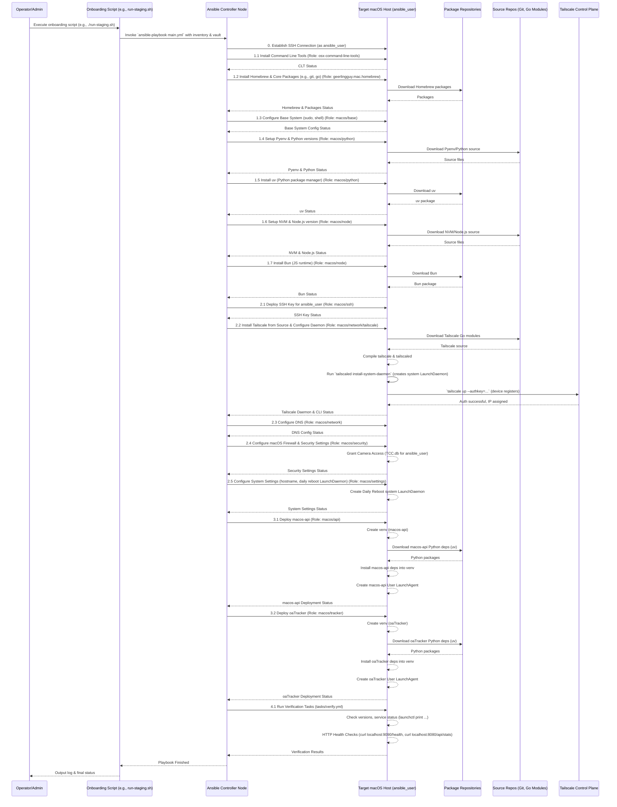
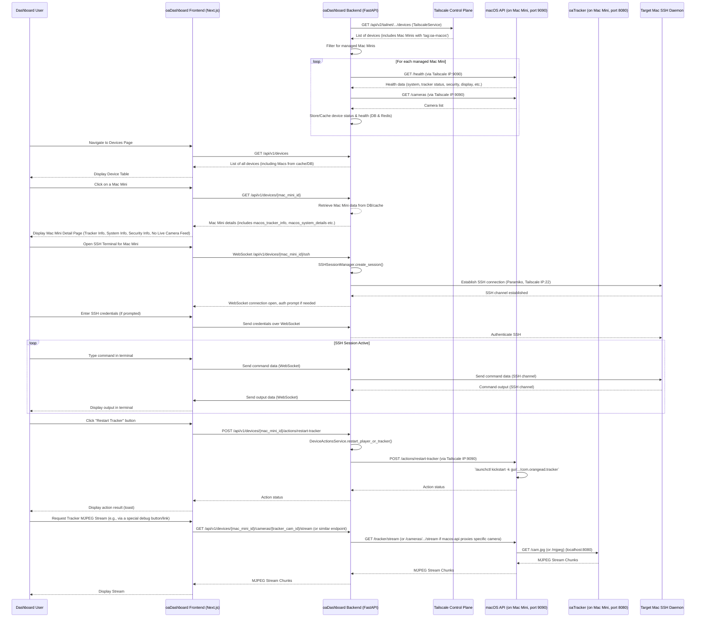

# oaPangaea System Sequence Diagrams

This document provides sequence diagrams to illustrate key workflows within the oaPangaea project, focusing on `oaAnsible` deployment and `oaDashboard` interactions.

## 1. `oaAnsible`: macOS Device Onboarding & Application Deployment

This diagram shows the typical flow when `oaAnsible` (via a script like `run-staging.sh` or `onboard-mac.sh`) configures a new macOS device and deploys `macos-api` and `oaTracker`.

## 2. `oaDashboard`: Monitoring & Interacting with a macOS Device

This diagram illustrates how `oaDashboard` (Frontend and Backend) interacts with a Mac Mini managed by `oaAnsible`.

## Notes on Diagrams

- **User Context**:
  - In Diagram 1 (`oaAnsible`), `ansible_user` is the user account on the `Target macOS Host` under which Ansible performs most operations and deploys applications.
  - The `Operator/Admin` is the human running the Ansible playbook from the `Ansible Controller Node`.
- **LaunchAgents vs. LaunchDaemons**:
  - `macos-api` and `oaTracker` are deployed as **User LaunchAgents** (`~/Library/LaunchAgents/`) and run as `ansible_user`.
  - `tailscaled` (Tailscale daemon) and the daily reboot task are configured as **System LaunchDaemons** (`/Library/LaunchDaemons/`) and run as `root`.
- **Installation Paths**:
  - Applications (`macos-api`, `oaTracker`) are installed under `{{ ansible_user_dir }}/orangead/`.
  - Core tools like `pyenv`, `nvm`, `go binaries` are typically installed in `ansible_user`'s home directory (e.g., `~/.pyenv`, `~/.nvm`, `~/go/bin`). Symlinks might be created in `/usr/local/bin` for system-wide CLI access.
- **API Interactions**:
  - `oaDashboard Backend` communicates with `macos-api` over Tailscale.
  - `macos-api` communicates with `oaTracker`'s API typically on `localhost` on the Mac Mini.

These diagrams should provide a clear overview of the system's architecture and key operational flows.
