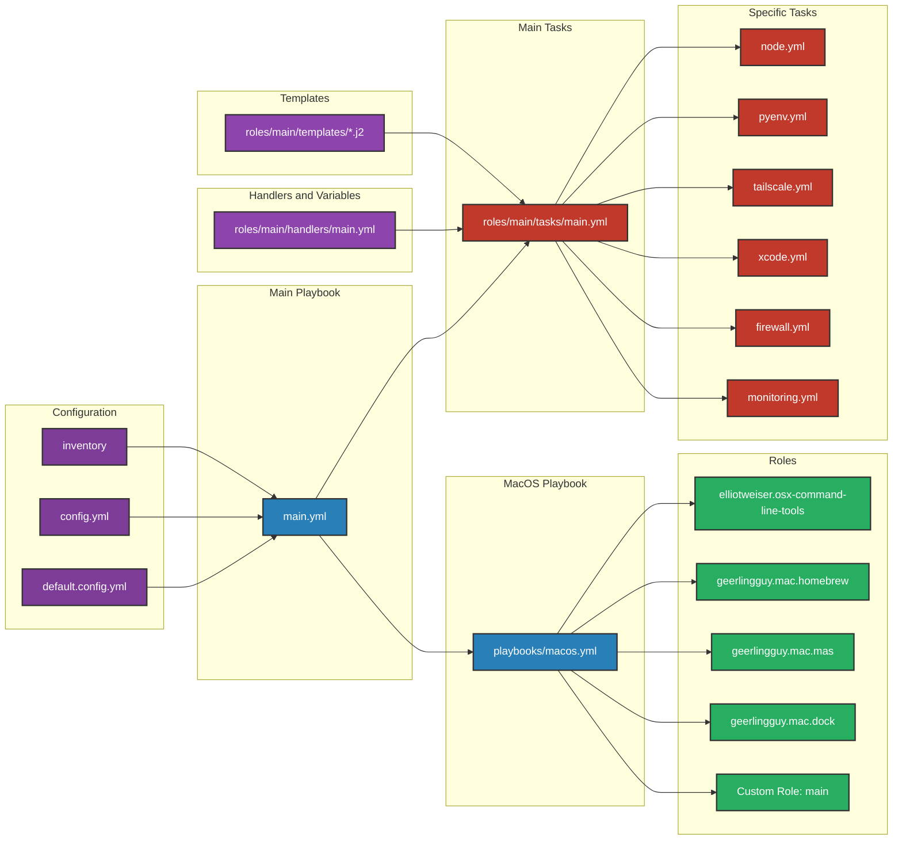

# Ansible Workflow Diagram

## Workflow Explanation

1. **Configuration Files**:

   - `default.config.yml` and `config.yml`: Define variables and settings.
   - `inventory`: Specifies target machines (e.g., b3) for the Ansible playbook.

2. **Main Playbook**:

   - `main.yml`: The entry point that orchestrates the entire process.

3. **MacOS Playbook**:

   - `playbooks/macos.yml`: Applies macOS-specific configurations.

4. **Roles**:

   - External roles for command-line tools, Homebrew, Mac App Store, and Dock configuration.
   - Custom role 'main' for project-specific tasks.

5. **Main Tasks**:

   - `roles/main/tasks/main.yml`: Central task file that imports specific tasks.

6. **Specific Tasks**:

   - Individual task files for different aspects of system configuration (node, pyenv, tailscale, etc.).

7. **Handlers and Variables**:

   - `roles/main/handlers/main.yml`: Defines handlers that can be called by tasks.

8. **Templates**:
   - Jinja2 templates used to generate configuration files on the target machine.

## Role Management

The project uses a combination of external roles (installed via ansible-galaxy) and a custom role:

1. **External Roles**:

   - Installed using `ansible-galaxy install -r requirements.yml`
   - Located in the `roles/` directory
   - Not tracked in Git (ignored via .gitignore)

2. **Custom Role 'main'**:
   - Located in `roles/main/`
   - Tracked in Git
   - Contains project-specific tasks and configurations

The `.gitignore` file is configured to ignore all contents of the `roles/` directory except for the `main/` subdirectory. This setup allows for easy management of both external and custom roles while keeping version control focused on project-specific code.

This improved diagram and explanation provide a clear visual representation of your Ansible project's structure and workflow, with distinct sections and color-coding for different types of components, including the management of custom and external roles.
