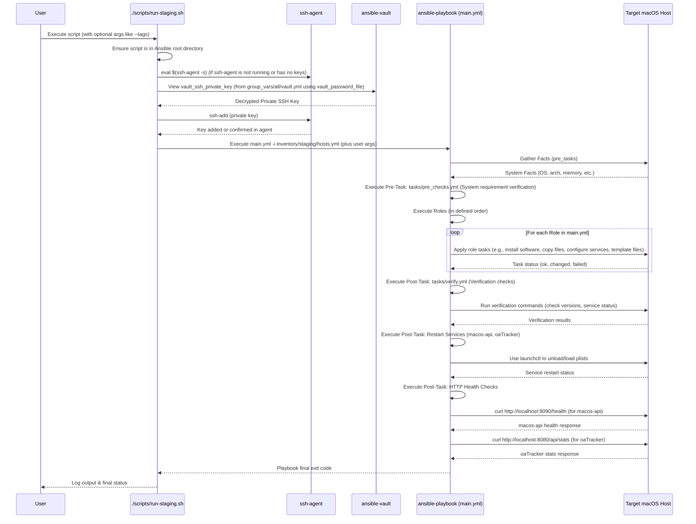
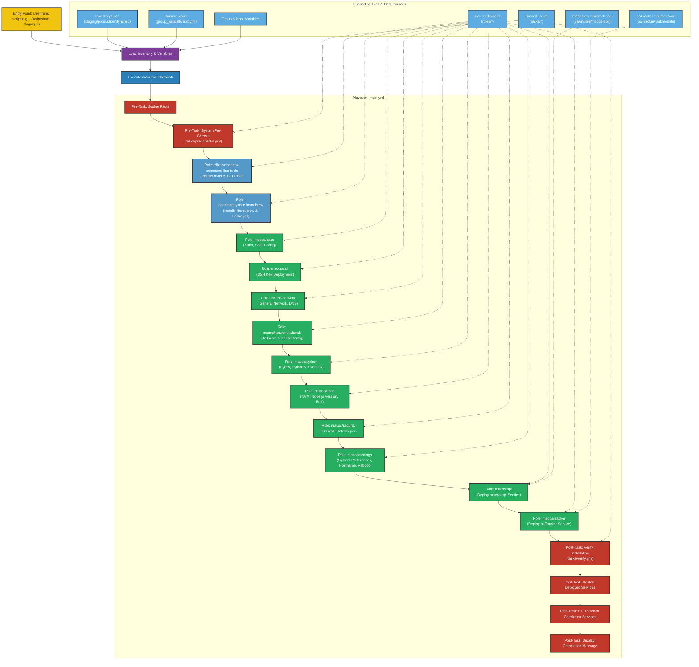

# Ansible Workflow for `oaAnsible`

This document outlines the workflow of the `oaAnsible` project, which is responsible for the automated setup, configuration, and application deployment on macOS devices (primarily Mac Minis) for OrangeAd.

## 1. Overview and Purpose

The `oaAnsible` project aims to provide a robust, idempotent, and automated way to:

- **Onboard new macOS devices**: Prepare them from a base macOS installation to a fully functional state.
- **Manage configurations**: Ensure consistent settings across all managed Macs.
- **Deploy applications**: Install and configure core services like the `macos-api` and `oaTracker`.
- **Integrate with Tailscale**: For secure remote access and dynamic inventory.

The system is designed to be run from a central control node (e.g., a developer's machine or a CI/CD server) against target macOS hosts accessible via SSH over Tailscale.

## 2. Key Components Managed by `oaAnsible`

`oaAnsible` handles the installation, configuration, and management of:

- **System Prerequisites**: macOS Command Line Tools, Homebrew.
- **Core Runtime Environments**:
  - Python (via `pyenv` for specific version control).
  - Node.js (via `nvm` for specific version control).
  - Bun (JavaScript runtime/bundler).
  - `uv` (Python package installer/resolver).
- **Networking & Security**:
  - Tailscale (compiled from source, configured as a system daemon).
  - Basic macOS firewall rules.
  - SSH authorized keys.
- **System Settings**:
  - Hostname, time zone, sleep settings, daily reboot schedule.
  - Security settings like Gatekeeper and screen lock.
- **Custom Applications & Services**:
  - `macos-api`: A FastAPI service for device monitoring and actions, run as a `launchd` service under the `ansible_user` (typically the `admin` user).
  - `oaTracker`: An AI-powered video tracking application, also run as a `launchd` service under the `ansible_user` (typically the `admin` user).

## 3. Core Workflow Principles

- **Idempotency**: Playbooks and tasks are designed to be run multiple times without causing unintended side effects. If a desired state is already achieved, Ansible should not make changes.
- **Role-Based Structure**: Functionality is modularized into Ansible roles for better organization and reusability.
- **Secrets Management**: Sensitive data (e.g., Tailscale authentication keys, SSH public keys) is managed using Ansible Vault.
- **Environment Separation**: Distinct inventory files and group variables for `staging` and `production` environments allow for tailored configurations.
- **Dynamic Inventory**: Option to use a dynamic inventory script (`inventory/dynamic_inventory.py`) that leverages the Tailscale API to discover and categorize macOS hosts.
- **Verification**: Post-deployment tasks (`tasks/verify.yml`) are included to check the status of key installations and services.

## 4. Sequence Diagram: Typical Staging Deployment (`run-staging.sh`)

This diagram illustrates the sequence of events when an operator runs the `run-staging.sh` script to apply the `main.yml` playbook to hosts in the staging inventory.

## 5. Flowchart Diagram: `main.yml` Playbook Execution Logic

This flowchart provides a high-level overview of the tasks and roles executed by the main `main.yml` playbook.

## 6. Detailed Workflow Explanation

### 6.1. Entry Points & Configuration Loading

The Ansible automation is typically initiated via wrapper scripts located in the `./scripts/` directory:

- `./scripts/run-staging.sh`: For development and testing against staging macOS devices. It handles SSH agent key loading.
- `./scripts/run-production.sh`: For deploying to production macOS devices, includes safety prompts.
- `./scripts/onboard-mac.sh`: A specialized script for provisioning new Mac Minis from scratch. It creates a temporary inventory.
- `./scripts/deploy-macos-api.sh`: Targets only the `macos-api` deployment.
- `./scripts/genSSH`: Deploys the SSH public key from the vault to a target host.

These scripts invoke `ansible-playbook` with the main playbook (`main.yml` or a specific one like `playbooks/deploy-macos-api.yml`) and target the appropriate inventory (e.g., `inventory/staging/hosts.yml`).

Ansible then loads configurations in the following order of precedence (higher overrides lower):

1. Command-line arguments (e.g., `-e "var=value"`).
2. Role defaults (`roles/<role>/defaults/main.yml`).
3. Inventory variables (host-specific in `hosts.yml`, group-specific in `inventory/<env>/group_vars/all.yml`).
4. Global variables from `group_vars/all/` (including `vault.yml` for encrypted secrets).
5. Playbook variables.

### 6.2. `main.yml` Playbook Execution

The `main.yml` playbook is the primary orchestrator for configuring macOS devices.

#### 6.2.1. Pre-Tasks

Before roles are executed, several pre-tasks run:

1. **Gather Facts**: Ansible's `setup` module collects detailed information (facts) about the target macOS hosts (hardware, OS version, network interfaces, etc.). This populates `ansible_*` variables.
2. **System Pre-Checks (`tasks/pre_checks.yml`)**:
    - Uses gathered facts to assert system requirements (e.g., minimum RAM, macOS distribution).
    - Sets custom facts like `memory_gb`, `homebrew_prefix`, `is_apple_silicon`.
    - Optionally debugs key system information.

#### 6.2.2. Roles Execution

Roles are executed sequentially as defined in `main.yml`. Each role encapsulates a specific area of configuration or deployment:

1. **`elliotweiser.osx-command-line-tools` (External Role)**:

    - Ensures macOS Command Line Tools are installed, which are necessary for many development and build tasks (like compiling Homebrew packages or Python versions).

2. **`geerlingguy.mac.homebrew` (External Collection/Role)**:

    - Installs Homebrew, the package manager for macOS.
    - Installs a list of essential system packages defined in inventory variables (e.g., `git`, `wget`, `curl`, `go`).

3. **`macos/base`**:

    - **Passwordless Sudo**: Configures passwordless `sudo` for the `ansible_user` (typically `admin`) to allow Ansible to perform privileged operations without repeated password prompts. This is done by adding an entry to `/etc/sudoers.d/`.
    - **Shell Configuration**: Modifies shell configuration files (e.g., `.zshrc`, `.bash_profile`) for the `ansible_user` to set up PATH, and initialize `pyenv` and `nvm` environments if they are configured to be installed.

4. **`macos/ssh`**:

    - Ensures the `~/.ssh` directory exists for the `ansible_user`.
    - Deploys the SSH public key (defined in `vault_ssh_public_key` from the Ansible Vault) to `~/.ssh/authorized_keys` on the target Mac. This allows passwordless SSH access for subsequent Ansible runs or manual SSH sessions using the corresponding private key.

5. **`macos/network`**:

    - Handles general network settings. Primarily, it configures DNS servers on the primary network interface. It attempts to preserve DHCP-provided DNS servers while adding Tailscale's Magic DNS servers (`100.100.100.100`) and public fallbacks if Tailscale is enabled.

6. **`macos/network/tailscale`**:

    - **Go Installation**: Ensures Go is installed (via Homebrew, handled by `geerlingguy.mac.homebrew` role if `go` is in its package list).
    - **Tailscale Binaries**: Compiles and installs the `tailscale` and `tailscaled` binaries from source using `go install tailscale.com/cmd/tailscale{,d}@latest`. The binaries are placed in `{{ ansible_env.HOME }}/go/bin`.
    - **Symlinks**: Creates symlinks for `tailscale` and `tailscaled` in `/usr/local/bin` for system-wide access.
    - **System Daemon (`tailscaled`)**:
      - Ensures operational directories like `/var/lib/tailscale` exist.
      - Uses `/usr/local/bin/tailscaled install-system-daemon` to install and configure the `com.tailscale.tailscaled` launchd service. This is the recommended way to set up the system daemon.
      - Ensures the service is enabled and loaded.
    - **Tailscale Authentication**:
      - Waits for `/var/run/tailscaled.socket` to be present.
      - Checks current Tailscale status using `tailscale status --json`.
      - If not logged in, or if hostname/tags are incorrect, it runs `tailscale up` with the `--authkey={{ vault_tailscale_auth_key }}`, `--hostname={{ inventory_hostname }}`, `--advertise-tags={{ vault_tailscale_tags_macos }}`, `--accept-dns=false`, `--ssh`, and potentially `--force-reauth` or `--reset` to ensure the device is correctly provisioned on the tailnet.
    - **Tailscale SSH**: Enables Tailscale SSH server on the device using `tailscale set --ssh`.

7. **`macos/python`**:

    - **Pyenv Installation**: Installs `pyenv` (Python version manager) by cloning its Git repository to `{{ ansible_env.HOME }}/.pyenv`.
    - **Shell Integration**: Adds `pyenv init -` to the user's shell profile.
    - **Python Version Installation**: Installs the specific Python version defined by the `python.version` inventory variable (e.g., "3.10.11") using `pyenv install {{ python.version }}`.
    - **Global Python Version**: Sets the installed version as the global default for the `pyenv` environment using `pyenv global {{ python.version }}`.
    - **uv Installation**: Installs the `uv` Python package manager via `curl -LsSf https://astral.sh/uv/install.sh | sh`. Adds `~/.cargo/bin` to PATH.

8. **`macos/node`**:

    - **NVM Installation**: Installs `nvm` (Node Version Manager) by downloading and running its install script.
    - **Shell Integration**: Adds `nvm.sh` sourcing to the user's shell profile.
    - **Node.js Version Installation**: Installs the Node.js version defined by the `node.version` inventory variable (e.g., "22.11.0") using `nvm install {{ node.version }}` and sets it as the default.
    - **Global NPM Packages**: Installs global npm packages listed in `node.packages` inventory variable.
    - **Bun Installation**: Installs the `bun` JavaScript runtime/bundler via `curl -fsSL https://bun.sh/install | bash`. Adds `~/.bun/bin` to PATH.

9. **`macos/security`**:

    - **Firewall**: Enables the macOS application firewall (`socketfilterfw`) and adds rules to allow incoming connections for essential services like `sshd`, `tailscaled`, and the Python executables for `macos-api` and `oaTracker`.
    - **Screen Lock**: Configures the screen saver to require a password after a short delay.
    - **FileVault Status**: Checks and displays FileVault status (does not enforce it).
    - **Gatekeeper**: Ensures Gatekeeper is enabled (`spctl --master-enable`).
    - **Password Policies**: Attempts to set a minimum password length using `pwpolicy`.

10. **`macos/settings`**:

    - **System Preferences**: Disables guest user, sets timezone (America/New_York), enables remote login (SSH), disables various sleep modes, and configures restart on power failure/freeze using `systemsetup`.
    - **Hostname**: Sets the macOS `HostName`, `ComputerName`, and `LocalHostName` to match `{{ inventory_hostname }}` using `scutil`.
    - **Daily Reboot**: Creates and loads a `launchd` plist (`com.orangead.dailyreboot.plist`) to schedule a daily reboot at a configurable time (defaults to 3:00 AM).

11. **`macos/api` (Deploy `macos-api` Service)**:

    - Creates directories: `/usr/local/orangead`, `/usr/local/orangead/macos-api`, and its `logs` subdirectory.
    - Synchronizes the `macos-api` application files from `oaAnsible/macos-api/` to `/usr/local/orangead/macos-api/` on the target, excluding `.venv`, `__pycache__`, etc.
    - Includes `tasks/python_detect.yml` to determine the correct `python_executable` (from `pyenv`).
    - Creates a Python virtual environment at `/usr/local/orangead/macos-api/.venv` using the detected `python_executable`.
    - Installs `uv` into the venv.
    - Installs Python dependencies specified in `oaAnsible/macos-api/requirements.txt` into this venv using `uv pip install`. This includes `numpy<2.0.0` and then other requirements.
    - Copies and runs `verify_opencv.py` within the venv to ensure OpenCV is functional.
    - Creates directories in the `ansible_user`'s home directory (`~/orangead/macos-api`).
    - Sets ownership of these directories to `ansible_user:staff`.
    - Templates the `com.orangead.macosapi.plist.j2` launchd service file, configuring it to run `uvicorn main:app` from the venv as the `ansible_user`. The `PYTHONPATH` and `TRACKER_ROOT_DIR` environment variables are set for the service.
    - Note: Screenshot functionality has been removed from the API.
    - Adds the API's Python executable (`/usr/local/orangead/macos-api/.venv/bin/python3`) to the macOS firewall.
    - Loads and starts the `com.orangead.macosapi` service via `launchctl`. Notifies a handler to reload the service if the plist changes.

12. **`macos/tracker` (Deploy `oaTracker` Service)**:
    - Creates directories for the tracker in the `ansible_user`'s home directory: `~/orangead/tracker` and `~/orangead/tracker/data`.
    - Creates a symbolic link from `events.db` to `data/events.db` to accommodate hardcoded paths in the tracker code.
    - Sets ownership of these directories to `ansible_user:staff`.
    - Synchronizes the `oaTracker` source code from the monorepo to the target machine.
    - Creates a Python virtual environment at `~/orangead/tracker/.venv` using the detected `python_executable`, owned by the `ansible_user`.
    - Installs core Python dependencies including OpenCV, Ultralytics (YOLO), PyTorch, FastAPI, etc.
    - Templates `config.yaml.j2` to `~/orangead/tracker/config.yaml`, owned by the `ansible_user`. This allows Ansible to configure `oaTracker` (e.g., camera ID, Yolo source).
    - Templates `com.orangead.tracker.plist.j2` launchd service file, configuring it to run `python -m app` from the `oaTracker` venv as the `ansible_user`. Sets `PYTHONPATH` and `PYTHONUNBUFFERED`.
    - Ensures the `com.orangead.tracker` service is loaded and started.
    - Displays a debug message reminding the user about manual camera permission grants for `oaTracker` on macOS.

#### 6.2.3. Post-Tasks

After all roles complete:

1. **Verify Installation (`tasks/verify.yml`)**:

    - Checks for `pyenv`, `nvm`, `uv`, `bun` installations and their versions.
    - Checks Tailscale binary existence, status, and version.
    - Checks Homebrew installation and presence of key packages.
    - Checks `launchd` status for `com.orangead.api` (should be `com.orangead.macosapi`) and `com.orangead.tracker`.
    - Displays a summary of verification results.

2. **Restart macOS Services**:

    - Explicitly unloads and loads the `com.orangead.macosapi.plist` and `com.orangead.tracker.plist` services using `launchctl`. This ensures changes are applied if the service definitions were updated.

3. **HTTP Health Checks**:

    - Performs `curl` requests to `http://localhost:9090/health` (for `macos-api`) and `http://localhost:8080/api/status` (for `oaTracker`'s API) on the target Mac to confirm the services are responding.
    - Displays the status of these checks.

4. **Display Completion Message**: Informs the user that the playbook has finished and a terminal restart might be needed to apply shell changes.

### 6.3. Secrets Management

- Ansible Vault (`group_vars/all/vault.yml`, encrypted) stores sensitive information like:
  - `vault_tailscale_auth_key`: Tailscale authentication key.
  - `vault_ssh_public_key`: Public SSH key for deploying to `authorized_keys`.
- The `vault_password_file` in the `oaAnsible` root contains the password to decrypt `vault.yml`. This file is gitignored.
- Playbooks and scripts use `--vault-password-file` to access vaulted variables.

### 6.4. Idempotency

- Most Ansible modules used (e.g., `file`, `template`, `service`, `homebrew`, `git`) are inherently idempotent.
- `command` and `shell` modules are used with care, often with `creates` arguments or `when` conditions based on state checks to maintain idempotency (e.g., only install if not present, only configure if current state is different).
- The goal is for the entire playbook run to converge the target system to the desired state without making unnecessary changes on subsequent runs.

## 7. Diagram Color Legend (Flowchart)

- 🟣 Configuration Files (Purple)
- 🔵 Playbooks (Blue)
- 🟢 Roles (Green) - Custom roles within `oaAnsible`
- 🟦 External Roles/Collections (Blue variant)
- 🔴 Tasks (Red)
- 🟡 Scripts (Yellow)
- 🟠 Decisions/Conditions (Orange) - _Implicit in role/task logic_
- 🧊 I/O & Data Sources (Light Blue variant) - _Representing file sources/data inputs_
