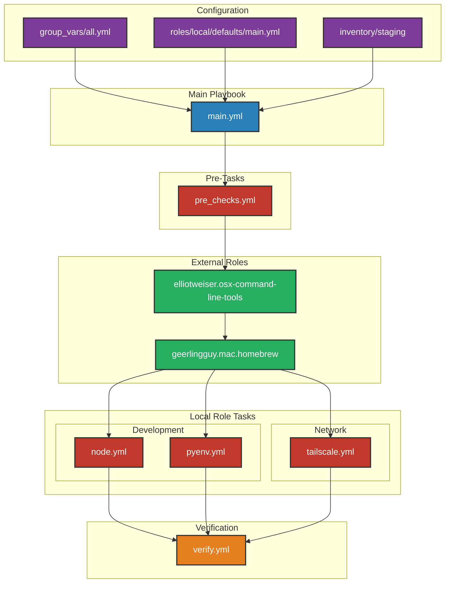

# Ansible Workflow Diagram

## Workflow Explanation

1. **Configuration Files**:
   - `group_vars/all.yml`: Environment-specific configurations
   - `roles/local/defaults/main.yml`: Default role configurations
   - `inventory/staging`: Host definitions

2. **Pre-flight Checks**:
   - System requirements verification
   - Directory structure setup
   - Network connectivity tests

3. **External Roles**:
   - Command Line Tools installation
   - Homebrew package management

4. **Local Role Tasks**:
   - **Development**:
     - Node.js setup with NVM
     - Python environment with pyenv
   - **Network**:
     - Tailscale (Go-compiled version)

5. **Verification**:
   - Installation checks
   - Service status verification
   - Configuration validation

## Task Flow

1. Load configurations from various sources
2. Run pre-flight system checks
3. Install system requirements
4. Configure development environment
5. Set up network services
6. Verify all installations and configurations

## Color Legend

- 🟣 Configuration Files (Purple)
- 🔵 Playbooks (Blue)
- 🟢 Roles (Green)
- 🔴 Tasks (Red)
- 🟠 Verification (Orange)
