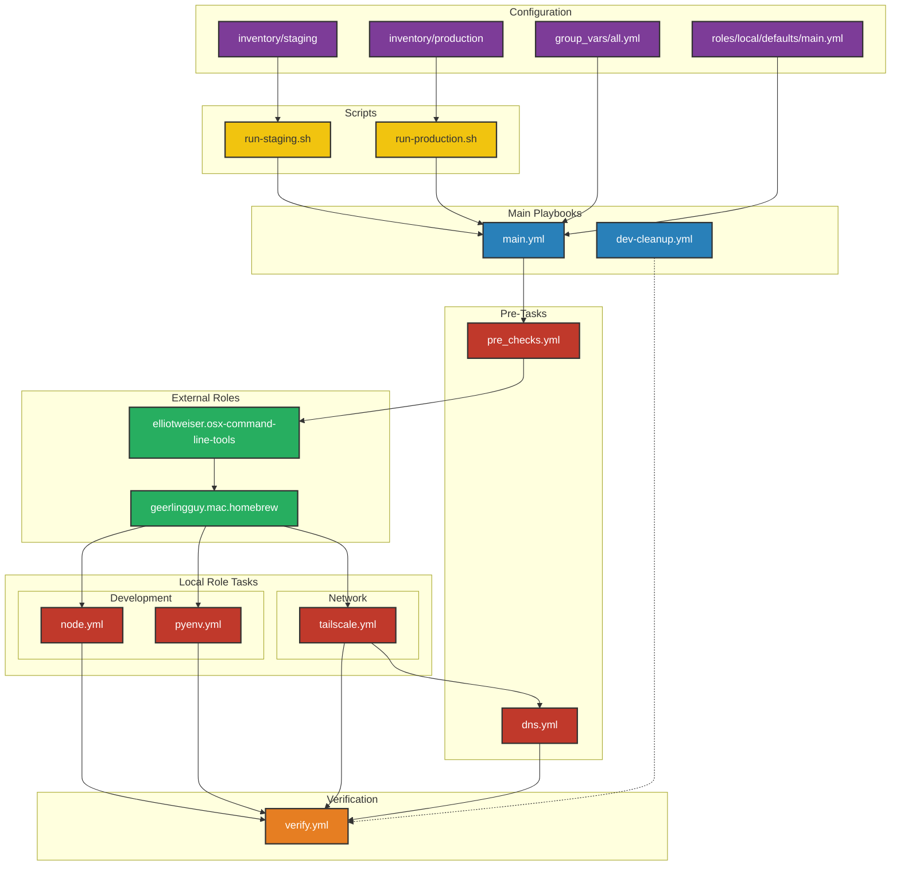

# Ansible Workflow Diagram

## Workflow Explanation

1. **Entry Points**:

   - Production deployment via `run-production.sh`
   - Staging deployment via `run-staging.sh`
   - Development cleanup via `dev-cleanup.yml`

2. **Configuration Files**:

   - `group_vars/all.yml`: Environment-specific configurations
   - `roles/local/defaults/main.yml`: Default role configurations
   - `inventory/staging` & `inventory/production`: Host definitions

3. **Pre-flight Checks**:

   - System requirements verification
   - Directory structure setup
   - Network connectivity tests

4. **External Roles**:

   - Command Line Tools installation
   - Homebrew package management

5. **Local Role Tasks**:

   - **Development**:
     - Node.js setup with NVM
     - Python environment with pyenv
   - **Network**:
     - Tailscale configuration
     - DNS management

6. **Verification**:
   - Installation checks
   - Service status verification
   - Configuration validation

## Color Legend

- 🟣 Configuration Files (Purple)
- 🔵 Playbooks (Blue)
- 🟢 Roles (Green)
- 🔴 Tasks (Red)
- 🟠 Verification (Orange)
- 🟡 Scripts (Yellow)
